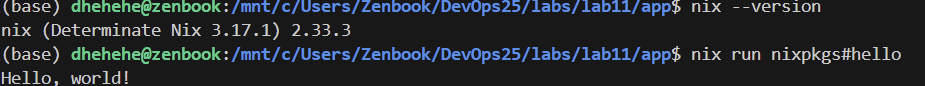
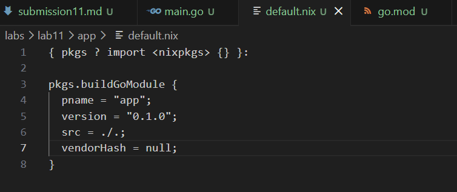

# Lab 1 Submission

## Task 1 — SSH Commit Signing

### Benefits of Signed Commits
Прочитав документации, можно сказть, что подпись коммитов важна, так как она позволяет проверять личность автора изменений git с помощью GPG или SSH-ключей, гарантировать, что содержимое коммита не было изменено после подписания, подтверждать, что коммит создан доверенным источником, а не злоумышленником, выполнять требования безопасности в регулируемых или open-source проектах, обнаруживать изменения

### Setup Evidence
Сгенерирован SSH ключ `~/.ssh/id_ed25519`, скриншот ключа в профиле

 
### Signed Commit
Создан файл submission1.md и сделаны несколько коммитов при редактировании, скриншот од ного из них с комментарием

### Why Important in DevOps?
В DevOps подпись коммитов критична для безопасности цепочки поставок (supply chain security). Она предотвращает внедрение вредоносного кода от имени других разработчиков.