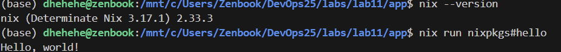
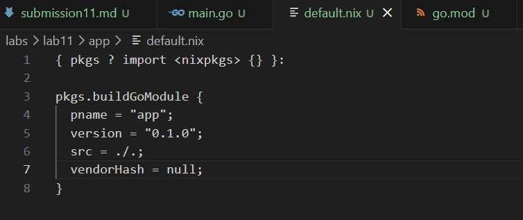
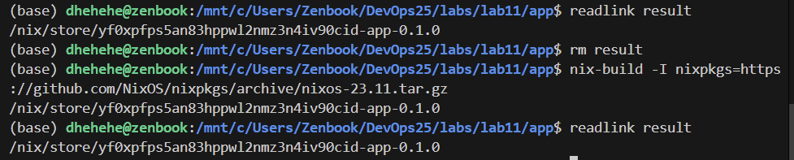
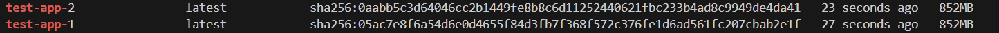
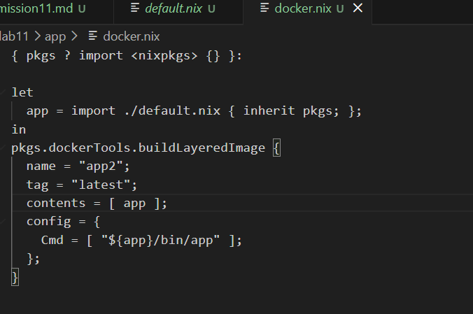
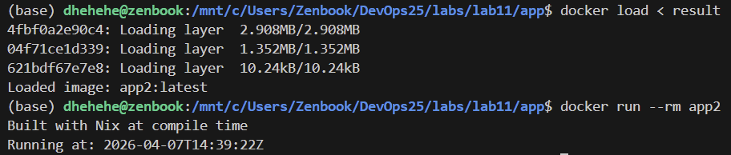

# Lab 11 — Reproducible Builds with Nix

> **Goal:** Learn to create truly reproducible builds using Nix, eliminating  "works on my machine" problems and achieving bit-for-bit reproducibility

---

## Tasks

### Task 1 — Build Reproducible Artifacts from Scratch (6 pts)

#### 1.1: Install Nix Package Manager

#### 1.2: Create a Simple Application
- [x]
#### 1.3: Write a Nix Derivation


`pkgs ? import <nixpkgs> {}` – параметр по умолчанию: набор всех пакетов Nixpkgs.

`buildGoModule` – стандартная функция Nix для сборки Go-проектов.

`pname / version `– имя и версия пакета.

`src = ./.;` – исходный код берётся из текущей директории.

`vendorHash = null;` – отключает проверку хеша зависимостей.

#### 1.4: Prove Reproducibility



**they're identical**

**SHA256 hash of the binary** is 45e698abac6d8855bc36816c4b645c2067654126690d640b526f08a0b0875a26  ./result/bin/app



**Why is Docker not reproducible?**

- Временные метки слоёв меняются при каждой сборке.
- Теги базовых образов могут указывать на разные версии.
- Сборка зависит от сети, кэша, текущего времени и состояния хост-системы.

**What makes Nix builds reproducible?**

- Сборка в изолированном окружении с фиксированными путями, без доступа к сети .
- Все пакеты (компилятор, библиотеки) идентифицируются по хешам.
- Путь в `/nix/store/<hash>-<name>` зависит от хеша всех входных данных.
- Nix с помощью `patchelf` и `strip` удаляет недетерминированные данные из бинарных файлов.

**Explanation of the Nix store path format and what each part means**

- `/nix/store` – глобальное хранилище всех собранных артефактов.
- `yf0xpfps5an83hppwl2nmz3n4iv90cid` – хеш (SHA256, усечённый до 32 символов base32) от всех входных данных: исходный код, зависимости, флаги компиляции, скрипты сборки.
- `app-0.1.0` – имя пакета и версия (задаются в derivation). Любое изменение входов → новый хеш → новый store path.
---

### Task 2 — Reproducible Docker Images with Nix (4 pts)

#### 2.1: Build Docker Image with Nix



Импортируем Nixpkgs и наше приложение из default.nix.

`buildLayeredImage` создаёт многослойный Docker-образ.

`name` и `tag `задают имя образа (app2:latest).

`contents` – что попадает в образ (только скомпилированный бинарник).

`config.Cmd` – команда по умолчанию при запуске контейнера.


**Сборка образа:**
```bash
nix-build docker.nix -I nixpkgs=https://github.com/NixOS/nixpkgs/archive/nixos-23.11.tar.gz
```
Результат: `/nix/store/fgv0acdyh0g6lnjqr64hc0r5m72g9vcv-app2.tar.gz`

**Загрузка в Docker:**
```bash
docker load < result
```
**Вывод:** `Loaded image: app2:latest`

**Запуск:**
```bash
docker run --rm app2
```
**Вывод:** `Built with Nix at compile time` и текущее время.

#### 2.2: Compare Image Sizes and Reproducibility

| Образ | Размер |
|-------|--------|
| `app2` (Nix) | 3.21 MB |
| `traditional-app` (Docker) | 2.01 MB |

**Проверка воспроизводимости Nix-образа:**  
Повторная сборка (с теми же исходниками) даёт тот же store pathи тот же хеш tar-архива. 

**Layer structure comparison**

**Вывод `docker history app2:latest`:**
```
IMAGE          CREATED   CREATED BY   SIZE      COMMENT
b55297e4749b   N/A                    61B       store paths: ['/nix/store/qvx386i73jcrgmx3s80s6av6szglv1r1-app2-customisation-layer']
<missing>      N/A                    1.34MB    store paths: ['/nix/store/va0hchfsiybjxc3yzlsp6mmbn1ad9zyj-app-0.1.0']
<missing>      N/A                    1.87MB    store paths: ['/nix/store/1ik2hkxnc9b4j6qnisdfrwi12wap675r-tzdata-2024a']
```
- Все слои имеют `CREATED = N/A` (фиксированная метка, отсутствие временной зависимости).  
- Каждый слой соответствует одному пакету из `/nix/store`.  
- Размеры слоёв: `tzdata` (1.87 MB), приложение (1.34 MB), кастомизация (61 B).

**Вывод `docker history traditional-app:latest`:**
```
IMAGE          CREATED         CREATED BY                      SIZE      COMMENT
d5f6dd636834   7 minutes ago   ENTRYPOINT ["/app"]             0B        buildkit.dockerfile.v0
<missing>      7 minutes ago   COPY /app/app /app # buildkit   2.01MB    buildkit.dockerfile.v0
```
- Слой с бинарником имеет временную метку `7 minutes ago` (меняется при каждой сборке).  
- Только один слой с данными (2.01 MB).

**Why are Nix-built images smaller and more reproducible?**  
- В Nix-образе каждый слой — это отдельный пакет, и временные метки заменены на эпоху (`N/A`).  
- Традиционный Dockerfile создаёт слой с временем `now`, что нарушает воспроизводимость.  
- Nix включает только необходимые файлы, а не весь Go-тулкит, но добавляет `tzdata` для корректного времени.  

**Practical advantages of content-addressable Docker images**  
- Безопасность (хеш = гарантия неизменности).  
- Экономия диска и сети (переиспользование слоёв между образами).  
- Детерминированные деплои (одинаковый образ на любой машине).

