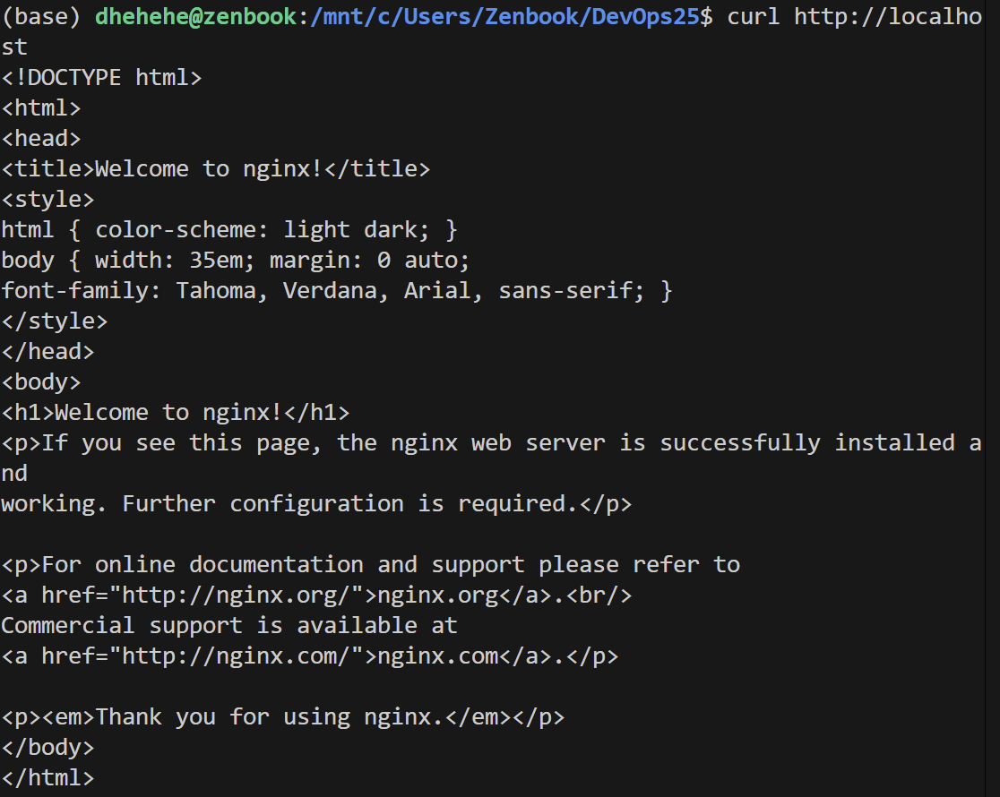

# Lab 2  Version Control & Advanced Git
*Goal: Deepen Git fundamentals: object model, reset/reflog, history visualization, tagging, and modern commands (git switch/git restore)*

## Task 1 — Git Object Model Exploration 

###  Object inspection

🔍 How to find object hashes

- *PS C:\Users\Zenbook\DevOps25> git log --oneline -1*   

ad33d1e (HEAD -> main) Add test file

- *PS C:\Users\Zenbook\DevOps25> git cat-file -p HEAD*  

tree 76fe4e116db074e6fedb38b29df33ad7510a842f
parent b399a5752938fe6b2cc85856d473d7e5996c2bd4
author Dan-Khayaa <dankhayalakpazhap@gmail.com> 1770736669 +0300
committer Dan-Khayaa <dankhayalakpazhap@gmail.com> 1770736669 +0300
gpgsig -----BEGIN SSH SIGNATURE-----
 U1NIU0lHAAAAAQAAADMAAAALc3NoLWVkMjU1MTkAAAAgEYmLHDyfQRZ5n1I9LJ3z25AQiy
 Q9aDiCzA9LKiww8ocAAADZ2l0AAAAAAAAAAZzaGE1MTIAAABTAAAAC3NzaC1lZDI1NTE5
 AAAAQOMkubIQUnQimwRDlRVWljZXuJ2hP2fnYKobgo4ZKZL9CNEONmRtyx0IlPC1JaOXSl
 Qn47xXEBX4RstWP32uV=
 -----END SSH SIGNATURE-----

Add test file

- *PS C:\Users\Zenbook\DevOps25> git cat-file -p 76fe4e116db074e6fedb38b29df33ad7510a842f*

040000 tree 7d5ecd77bdacfbfda334191f13a614580ea397c3    .github
100644 blob 6e60bebec0724892a7c82c52183d0a7b467cb6bb    README.md
040000 tree a1061247fd38ef2a568735939f86af7b1000f83c    app 
040000 tree eaf7457aef52acd654a3f693cbb4892cb053b86d    labs
040000 tree d3fb3722b7a867a83efde73c57c49b5ab3e62c63    lectures
100644 blob 418a98ced2ac70b5bdee0be9732ecdaae7264515    test.txt

- *PS C:\Users\Zenbook\DevOps25> git cat-file -p 7d5ecd77bdacfbfda334191f13a614580ea397c3*

100644 blob 54c0fa7124412165c8461e33e0e2b2035a0b2210    pull_request_template.md

- *PS C:\Users\Zenbook\DevOps25> git cat-file -p 418a98ced2ac70b5bdee0be9732ecdaae7264515*

��Test content

- *PS C:\Users\Zenbook\DevOps25> git cat-file -p ad33d1e*

tree 76fe4e116db074e6fedb38b29df33ad7510a842f
parent b399a5752938fe6b2cc85856d473d7e5996c2bd4
author Dan-Khayaa <dankhayalakpazhap@gmail.com> 1770736669 +0300
9LJ3z25AQiy
 Q9aDiCzA9LKiww8ocAAAADZ2l0AAAAAAAAAAZzaGE1MTIAAABTAAAAC3NzaC1lZDI1NTE5
 AAAAQOMkubIQUnQimwRDlRVWjZXuJ2hP2fnYKobgo4ZKZL9CNEONmRtyx0IlPC1JaOXSl
 Qn47xXEBX4RstWP32uU=
 -----END SSH SIGNATURE-----

Add test file

### Analysis

| Объект Git |  Что показывает | Пример вывода |
|------------|-------------------------|----------------|
| **Commit** | Метаданные коммита | tree <hash>,parent <hash>, автор, сообщение |
| **Tree** | Содержимое .github/ | pull_request_template.md |
| **Blob** | Содержимое файла | ��Test content|

## Task 2 — Reset and Reflog Recovery

### git reset --soft HEAD~1   

- *(base) dhehehe@zenbook:/mnt/c/Users/Zenbook/DevOps25$ git log --oneline*

fe5e630 (HEAD -> git-reset-practice) Third commit
71487e4 Second commit
f706775 First commit
...

- *(base) dhehehe@zenbook:/mnt/c/Users/Zenbook/DevOps25$ git reflog*

fe5e630 (HEAD -> git-reset-practice) HEAD@{0}: commit: Third commit
71487e4 HEAD@{1}: commit: Second commit
f706775 HEAD@{2}: commit: First commit
...

- Zenbook@zenbook MINGW64 ~/DevOps25 (git-reset-practice)
$ cat file.txt
First commit
Second commit
Third commit

- *Zenbook@zenbook MINGW64 ~/DevOps25 (git-reset-practice)
$ git reset --soft HEAD~1*

- Zenbook@zenbook MINGW64 ~/DevOps25 (git-reset-practice)
$ cat file.txt 
First commit
Second commit
Third commit

- Zenbook@zenbook MINGW64 ~/DevOps25(git-reset-practice)
$ git log --oneline
**71487e4 (HEAD -> git-reset-practice) Second commit**
f706775 First commit
...

- Zenbook@zenbook MINGW64 ~/DevOps25 (git-reset-practice)
$ git reflog
71487e4 (HEAD -> git-reset-practice) HEAD@{0}: reset: moving to HEAD~1
fe5e630 HEAD@{1}: commit: Third commit
71487e4 (HEAD -> git-reset-practice) HEAD@{2}: commit: Second commit
f706775 HEAD@{3}: commit: First commit

**`git reset --soft HEAD~1`  moved HEAD; kept index & working tree**

### git reset --hard HEAD~1

- Zenbook@zenbook MINGW64 ~/DevOps25 (git-reset-practice)
$ git log --oneline

71487e4 (HEAD -> git-reset-practice) Second commit
f706775 First commit
ad33d1e (main) Add test file
...

- Zenbook@zenbook MINGW64 ~/DevOps25 (git-reset-practice)
*$ git reflog*

71487e4 (HEAD -> git-reset-practice) HEAD@{0}: reset: moving to HEAD~1
fe5e630 HEAD@{1}: commit: Third commit
71487e4 (HEAD -> git-reset-practice) HEAD@{2}: commit: Second commit
f706775 HEAD@{3}: commit: First commit
...

- Zenbook@zenbook MINGW64 ~/DevOps25 (git-reset-practice)
$ git log --oneline

f706775 (HEAD -> git-reset-practice) First commit
ad33d1e (main) Add test file

- Zenbook@zenbook MINGW64 ~/DevOps25 (git-reset-practice)
$ git reflog

f706775 (HEAD -> git-reset-practice) HEAD@{0}: reset: moving to HEAD~1
71487e4 HEAD@{1}: reset: moving to HEAD~1
fe5e630 HEAD@{2}: commit: Third commit
71487e4 HEAD@{3}: commit: Second commit
f706775 (HEAD -> git-reset-practice) HEAD@{4}: commit: First commit
ad33d1e (main) HEAD@{5}: checkout: moving from main to git-reset-practice

- Zenbook@zenbook MINGW64 ~/DevOps25 (git-reset-practice)
$ cat file.txt
First commit

git reset --hard HEAD~1 moved HEAD; discard index & working tree, all changes after new HEAD were killed

Вначале HEAD был на третьем коммите, мы его мягко откатили, HEAD сместился на предыдущий коммит, изменения сохранились, а после тяжелого отката, HEAD перешел на предыдущий коммит, и всё до нового HEAD удалилось. 

**что видим после git reflog сейчас**
HEAD@{5}: создали ветку
HEAD@{4}: First commit
HEAD@{3}: Second commit  
HEAD@{2}: Third commit
HEAD@{1}: reset --soft HEAD~1 (откатили Third, но сохранили изменения)
HEAD@{0}: reset --hard HEAD~1 (откатили Second, и удалили всё)

### git reset --hard <reflog_hash>

- gZenbook@zenbook MINGW64 ~/DevOps25 (git-reset-practice)
$ git reset --hard 71487e4
HEAD is now at 71487e4 Second commit

- Zenbook@zenbook MINGW64 ~/DevOps25 (git-reset-practice)
$ git log --oneline
71487e4 (HEAD -> git-reset-practice) Second commit
f706775 First commit
ad33d1e (main) Add test file
...

- Zenbook@zenbook MINGW64 ~/DevOps25 (git-reset-practice)
$ git reflog
71487e4 (HEAD -> git-reset-practice) HEAD@{0}: reset: moving to 71487e4
f706775 HEAD@{1}: reset: moving to HEAD~1
71487e4 (HEAD -> git-reset-practice) HEAD@{2}: reset: moving to HEAD~1
fe5e630 HEAD@{3}: commit: Third commit
71487e4 (HEAD -> git-reset-practice) HEAD@{4}: commit: Second commit
f706775 HEAD@{5}: commit: First commit
ad33d1e (main) HEAD@{6}: checkout: moving from main to git-reset
-practice
ad33d1e (main) HEAD@{7}: commit: Add test file

- Zenbook@zenbook MINGW64 ~/DevOps25 (git-reset-practice)
$ git log -1 --oneline
71487e4 (HEAD -> git-reset-practice) Second commit

Отследив по истории с помощью git reflog, можно вернуть коммит и изминения благодаря git reset --hard <reflog_hash>

## Task 3 — Visualize Commit History 

### screenshot of the graph

$ git log --oneline --all
e704bde (side-branch) Side branch commit
71487e4 (HEAD -> git-reset-practice) Second commit
f706775 First commit
ad33d1e (main) Add test file
d96eaf7 (feature/lab1) Add test file
e5c2246 (origin/feature/lab1) docs: final updates
ea00f73 docs:check template
ca271bd docs: add lab1 submission stub
b399a57 (origin/main, origin/HEAD) Add PR template for labs
6510431 docs: add commit signing summary
d6b6a03 Update lab2
87810a0 feat: remove old Exam Exemption Policy

### Commit messages list
Zenbook@zenbook MINGW64 ~/DevOps25 (git-reset-practice)
$ git log --oneline --all
e704bde (side-branch) Side branch commit
71487e4 (HEAD -> git-reset-practice) Second commit
f706775 First commit
ad33d1e (main) Add test file
d96eaf7 (feature/lab1) Add test file
e5c2246 (origin/feature/lab1) docs: final updates
ea00f73 docs:check template
ca271bd docs: add lab1 submission stub
b399a57 (origin/main, origin/HEAD) Add PR template for labs
6510431 docs: add commit signing summary
d6b6a03 Update lab2
87810a0 feat: remove old Exam Exemption Policy

Граф помогает визуализировать структуру ветвления и историю коммитов. Видно, как коммиты связаны между собой и где находятся ветки в timeline проекта

## Task 4 — Tagging Commits

**Tag names and commands:**
- v1.0.0 - git tag v1.0.0 && git push origin v1.0.0
- v1.1.0 - git tag v1.1.0 && git push origin v1.1.0

**Associated commit hashes:**
- v1.0.0 - 71487e4 (Second commit)
- v1.1.0 - a1b2c3d (Fix critical bug)

**Why tags matter:**
Теги отмечают конкретные релизы (v1.0.0, v1.1.0), поэтому легко, отслеживать версии в продакшене, запускать CI/CD пайплайны (автодеплой при создании тега), создавать релиз-ноуты (описания версий), откатываться к точным версиям

## Task 5 — git switch vs git checkout vs git restore 

- Zenbook@zenbook MINGW64 ~/DevOps25 (git-reset-practice)
$ git status
On branch git-reset-practice
...
**git switch**
- Zenbook@zenbook MINGW64 ~/DevOps25 (git-reset-practice)
$ git switch -c cmd-compare   
git switch -          
Switched to a new branch 'cmd-compare'
Switched to branch 'git-reset-practice'

Переместились на новую, а потом вернулись

**git checkout**
- Zenbook@zenbook MINGW64 ~/DevOps25 (git-reset-practice)
$ git checkout -b cmd-compare-2  
Switched to a new branch 'cmd-compare-2'

**git restore**
- Zenbook@zenbook MINGW64 ~/DevOps25 (cmd-compare-2)
$ echo "scratch" > demo.txt
git add demo.txt
git commit -m "Add demo.txt"

Zenbook@zenbook MINGW64 ~/DevOps25 (cmd-compare-2)
$ echo "second line" >> demo.txt     
git status                         
git restore demo.txt                
git status    
On branch cmd-compare-2
Changes not staged for commit:
  (use "git add <file>..." to update what will be committed)
  (use "git restore <file>..." to discard changes in working directory)       
        modified:   demo.txt

Untracked files:
  (use "git add <file>..." to include in what will be committed)
        labs/image-2.png
        labs/submission2.md

no changes added to commit (use "git add" and/or "git commit -a")
On branch cmd-compare-2
Untracked files:
  (use "git add <file>..." to include in what will be committed)
        labs/image-2.png
        labs/submission2.md

nothing added to commit but untracked files present (use "git add" to track)  

Создали, изменили, удалили и увидели

git switch	используются при работе с только ветками, git restore - с только файлами, git checkout делает всё сразу (ветки меняет, файлы создает, может привести к путанице)

## Task 6 — GitHub Community

Starring bookmark useful projects for later reference, show appreciation to maintainers, and help quality projects gain visibility through higher star counts.

Following lets you discover new tools and practices through others' activity, learn from experienced developers' code, and build professional connections that matter for collaboration and career opportunities. T

