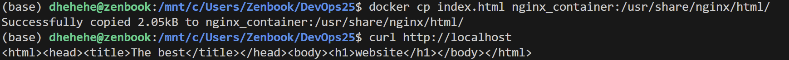
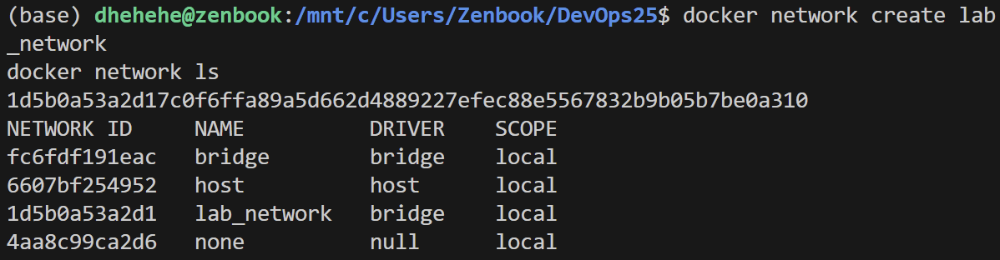
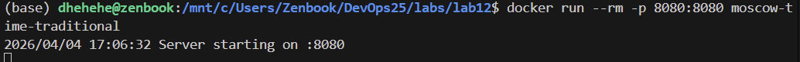
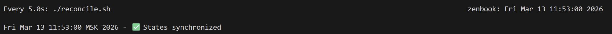
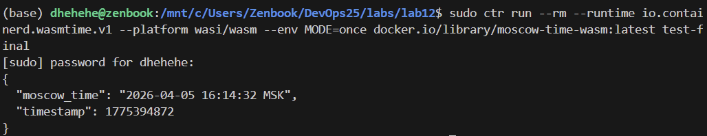

# Lab 3 — CI/CD with GitHub Actions 

**Goal**: Build foundational CI/CD workflows using GitHub Actions or GitLab CI: quickstart, triggers, logs, and system information

## Task 1 — First GitHub Actions Workflow

link to logs og workflow running: https://github.com/dh-lakpazhap/DevOps25/actions/runs/22186998553/job/64163497038

I made the file `.github/workflows/github-actions-demo.yml` so created first workflow and saw my actions and results.

- jobs — набор задач, выполняемых на одном раннере

- steps — последовательность команд внутри job

- runs-on — выбор операционной системы раннера

- uses — использование готового action 

- run — выполнение shell-команды.

- on: [push] — триггер.

Workflow automaticly runned after [push], every steps like in `.github/workflows/github-actions-demo.yml` and we can see ouyput in logs.

## Task 2 — Manual Trigger + System Information

Добавила `workflow_dispatch` и запустила с Github'a 

Добавлен новый шаг `Gather system information`, который выполняет команды:
   - `uname -a` — информация о ядре ОС,
   - `lscpu` — детали процессора,
   - `free -h` — использование памяти,
   - `df -h` — информация о дисках.

- **Автоматический запуск (`push`)** происходит сразу после отправки коммита в репозиторий. Это удобно для непрерывной интеграции — каждый раз при изменении кода workflow проверяет его.
- **Ручной запуск (`workflow_dispatch`)** позволяет инициировать выполнение в любой момент через интерфейс GitHub. Это полезно для тестирования, отладки или запуска workflow без создания нового коммита (например, для проверки на другой ветке или повторного выполнения).

**Операционная система**: Ubuntu 24.04.1 LTS (судя по версии ядра и #17~24.04.1-Ubuntu).

**Архитектура:** x86_64 (64-битная).

**Процессор:** 4 виртуальных CPU (AMD EPYC 7763, частота ~2.4 ГГц, 2 ядра с 2 потоками каждое).

**Кэш-память:** L1d 64 KiB, L1i 64 KiB, L2 1 MiB, L3 32 MiB.

**Память:** 15 GiB RAM, 3 GiB swap.

**Диск:** корневой раздел ~145 GiB, свободно 92 GiB. Также присутствуют разделы для загрузки (/boot, /boot/efi) и виртуальные файловые системы.

**Виртуализация:** AMD-V, гипервизор Microsoft — значит, раннер работает на виртуальной машине Azure.

**Уязвимости:** Часть уязвимостей процессора не подвержены, некоторые требуют микрокода (например, Spec rstack overflow, Tsa). В целом это типичное состояние для виртуальных сред. 