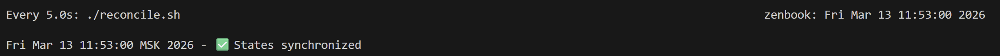
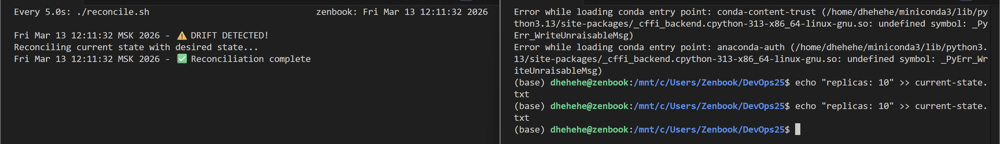
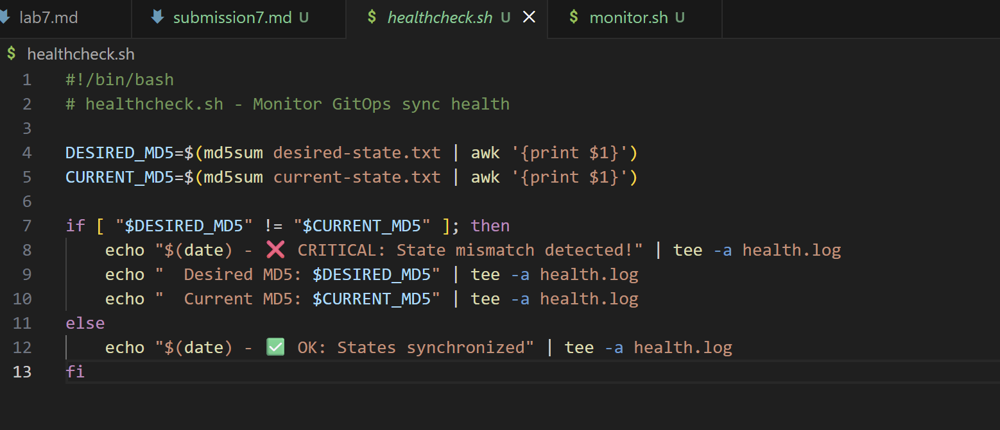
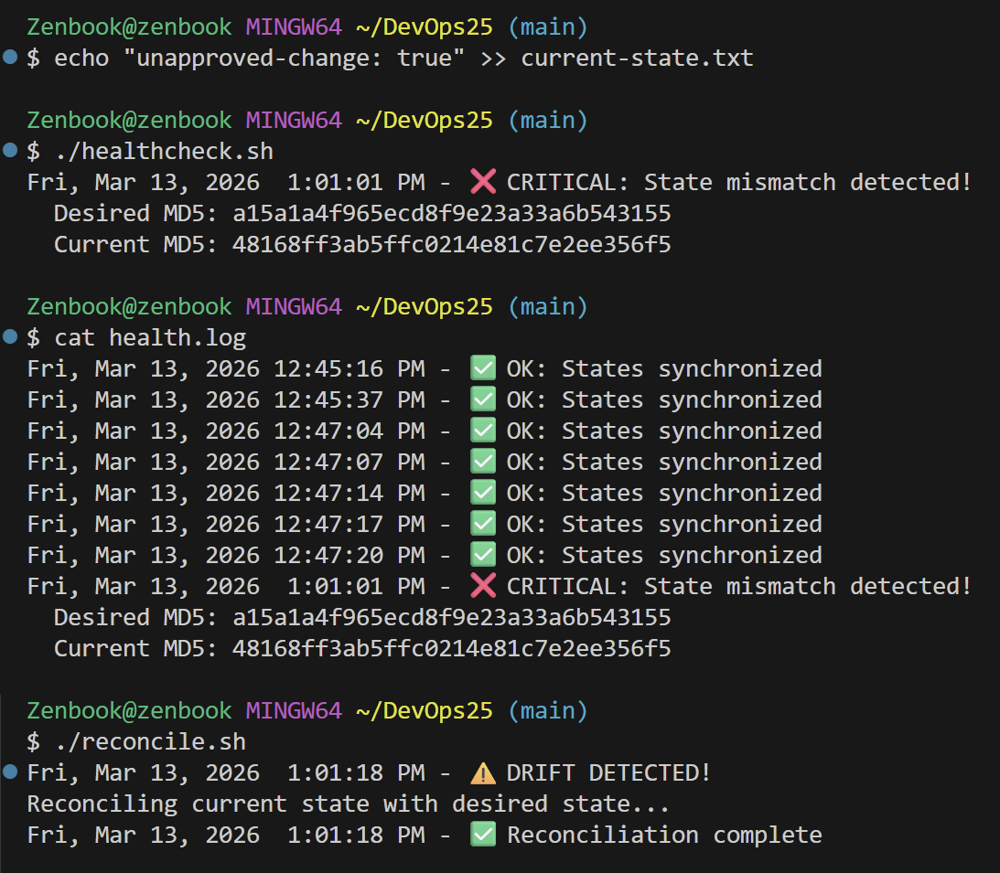
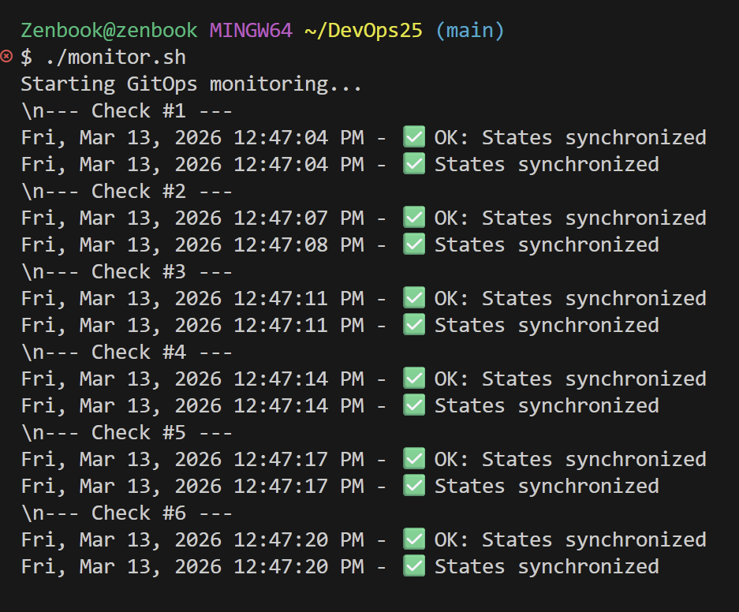

# Lab 7 — GitOps Fundamentals

> **Goal:** Understand core GitOps principles through simulated reconciliation loops and health monitoring using only Linux command-line tools.  

### Task 1 — Git State Reconciliation 

After simulating manual drift

**Drift was detected and reconciliated**

**Automated Continuous Reconciliation**

   Watch the reconciliation loop automatically detect and fix the drift within 5 seconds.

**Analysis: GitOps Reconciliation Loop**

The GitOps reconciliation loop continuously:
1. **Observes** current cluster state
2. **Compares** it with desired state stored in Git
3. **Acts** to correct any drift by applying desired state

This prevents configuration drift by ensuring any manual changes are automatically detected and reverted, maintaining Git as the single source of truth.

**Reflection: Declarative vs Imperative Configuration**

Declarative configuration (defining WHAT) is superior to imperative (defining HOW) in production because:
- **Idempotency**: Same declaration always produces same result
- **Self-healing**: System can automatically correct drift
- **Auditability**: Git provides complete change history
- **Predictability**: No hidden state from step-by-step commands

### Task 2 — GitOps Health Monitoring 

**Contents of healthcheck.sh script**

**Output showing "OK" and output showing "CRITICAL" and Complete health.log file showing multiple checks**

**Output from monitor.sh showing continuous monitoring**

**Analysis: How do checksums (MD5) help detect configuration changes?**

MD5 checksums create unique digital fingerprints of files. When a file changes (even by one character), its MD5 hash changes completely, allowing instant drift detection without comparing entire file contents.

**Comparison: How does this relate to GitOps tools like ArgoCD's "Sync Status"?**

Our MD5 comparison mirrors ArgoCD's sync mechanism:
- "OK" = ArgoCD "Synced" (Git = Cluster)
- "CRITICAL" = ArgoCD "OutOfSync" (Git ≠ Cluster)
- `cp desired current` = ArgoCD sync operation
- `watch -n 5` = ArgoCD auto-sync
