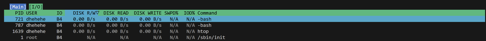
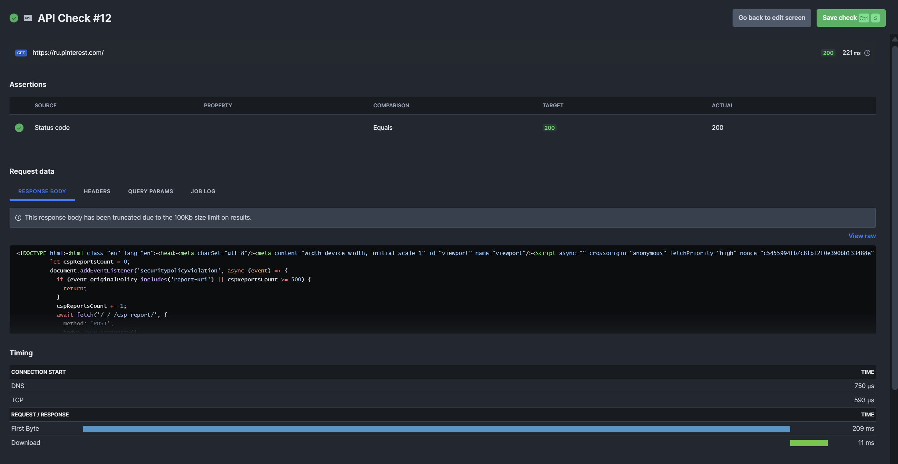
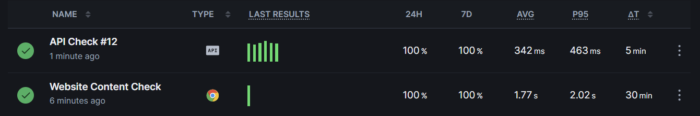
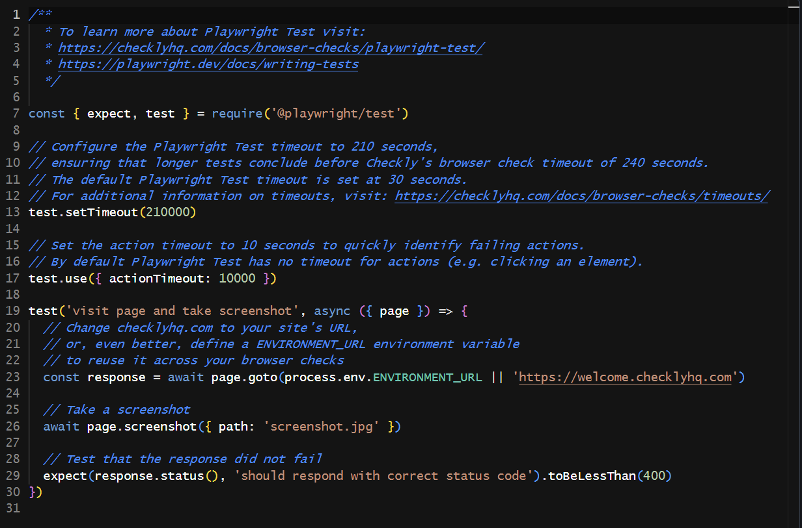
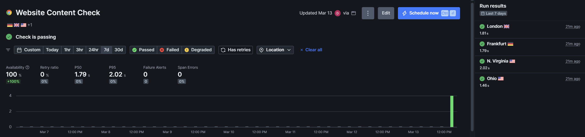
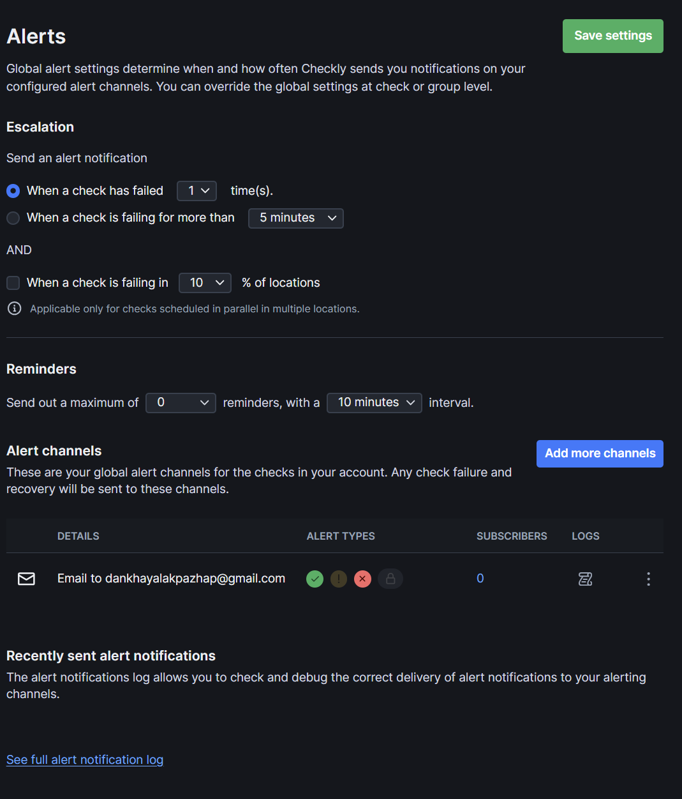

# Lab 8 — Site Reliability Engineering (SRE)

**Goal**: Explore Site Reliability Engineering principles through system monitoring, performance analysis, and practical website monitoring setup

## Task 1 — Key Metrics for SRE and System Analysis

**Top 3 most consuming applications for CPU, memory, and I/O usage**

**iostat output (first sample)**
Linux 6.6.87.2-microsoft-standard-WSL2 (zenbook) 03/13/26 _x86_64_ (16 CPU)

avg-cpu:  %user   %nice %system %iowait  %steal   %idle
           0.17    0.00    0.17    0.14    0.00   99.52

Device            r/s     rkB/s   rrqm/s  %rrqm r_await rareq-sz     w/s     wkB/s   wrqm/s  %wrqm w_await wareq-sz     d/s     dkB/s   drqm/s  %drqm d_await dareq-sz     f/s f_await  aqu-sz  %util
sda              4.19    273.12     1.61  27.75    0.32    65.24    0.00      0.00     0.00   0.00    0.00     0.00    0.00      0.00     0.00   0.00    0.00     0.00    0.00    0.00    0.00   0.10
sdb              0.54     28.95     0.26  32.11    0.33    53.17    0.00      0.00     0.00   0.00    0.00     0.00    0.00      0.00     0.00   0.00    0.00     0.00    0.00    0.00    0.00   0.01
sdc              0.36      8.20     0.00   0.00    0.04    22.73    0.01      0.01     0.00   0.00    3.00     2.00    0.00      0.00     0.00   0.00    0.00     0.00    0.00    4.00    0.00   0.00
sdd             51.34   2154.73    15.76  23.49    0.28    41.97    8.80    475.62    14.75  62.63    2.98    54.03    0.60   1083.11     0.10  14.74    0.21  1817.48    1.95    1.25    0.04   1.30

- CPU is mostly idle (99.5%), indicating the system is not under load
- The small amount of CPU time is split between user processes (0.17%) and system/kernel (0.17%)
- iowait is minimal (0.14%), showing that disk I/O is not causing CPU delays
- sdd is the most active disk with ~51 reads/sec and ~9 writes/sec
- Low await times (<3ms) indicate good disk performance
- Overall disk utilization is low (max 1.3%), no I/O bottleneck
- Since the system is mostly idle, no immediate optimization needed

## Task 2 — Practical Website Monitoring Setup

https://ru.pinterest.com/ Website URL were chosen to monitor

- **API Check (status code 200)**: Ensures basic website availability - the foundation of monitoring
- **Browser Check with content validation**: Verifies real user experience, not just server response
- **Search field visibility**: Critical UI element for Pinterest - without it, site is unusable
- **Load time threshold (5 seconds)**: Based on Core Web Vitals - users expect fast loading
- **Alert after 1 failure**: Immediate notification for critical issues (no waiting)
- **30-minute frequency**: Balances coverage with free tier limits

This setup addresses **3 of 4 Golden Signals of SRE**:

| Signal | How we monitor it |
|--------|-------------------|
| **Latency** | Browser check measures page load time (<5s threshold) |
| **Errors** | API check (200 status) + Browser check (content validation) |
| **Traffic** | (Indirectly) via response times under load |
| **Saturation** | Load times indicate system capacity |

**Benefits:**
- **Proactive detection** - know about issues before users report them
- **User-centric** - browser checks simulate real behavior
- **Geographic coverage** - checks from multiple regions
- **Actionable alerts** - immediate email notifications

**Result**: Early problem detection, faster incident response, better user experience.

